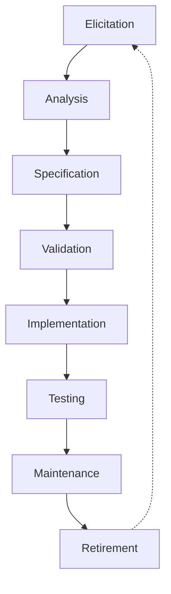
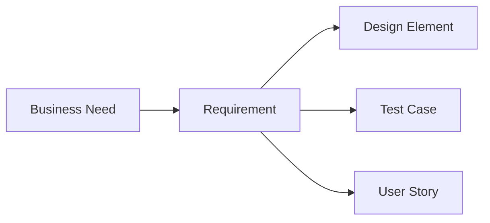

In this page, you'll learn:

- What requirements life cycle management is and why it's crucial
- How to effectively track and maintain requirements
- Techniques for prioritizing and organizing requirements
- Strategies for managing requirement changes
- Best practices for requirements traceability

## Welcome to the Requirements Rodeo: Where Digital Dust Never Settles!

Howdy, partner! You've just moseyed into the wild world of Requirements Life Cycle Management. It's like herding cats, but the cats are digital, constantly changing, and occasionally sprout wings. Don't worry if you feel like you're trying to lasso a tornado; by the end of this page, you'll be wrangling those requirements like a pro rodeo star!

### What in Tarnation is Requirements Life Cycle Management?

Requirements Life Cycle Management is the process of organizing, tracking, and maintaining requirements from their birth (when someone first says "Wouldn't it be nice if...") to their retirement (when the solution is decommissioned or the requirement is no longer needed). It's like being a parent to a bunch of very demanding, constantly evolving digital children.

**Remember:** Requirements aren't set in stone. They're more like clay - moldable, changeable, and occasionally messy.

## The Requirements Life Cycle: From Cradle to Grave (and Sometimes Zombie Afterlife)

Let's break down the life of a requirement, from its first breath to its last gasp (and sometimes its undead resurrection):

1. **Elicitation**: The requirement is born! Someone has an idea or identifies a need.
2. **Analysis**: We figure out what the requirement really means and how it fits with others.
3. **Specification**: We write it down in a way that everyone (hopefully) understands.
4. **Validation**: We make sure it's a good requirement that actually provides value.
5. **Implementation**: The requirement gets built into the solution.
6. **Testing**: We check if the implemented requirement does what it's supposed to.
7. **Maintenance**: We keep an eye on the requirement, making sure it's still relevant and useful.
8. **Retirement**: When the requirement is no longer needed, we send it off to the great backlog in the sky.

**Tip:** Notice that dotted line from Retirement back to Elicitation? That's because sometimes old requirements come back to life in new projects. It's the circle of (requirements) life!

## Tracking Requirements: Like Tagging Cattle, But Digital

Keeping track of requirements is crucial. It's like being a cowboy with a really, really good memory (or a really, really good notebook). Here are some key things to track:

1. **Unique Identifier**: Every requirement needs its own brand (ID).
2. **Description**: What the requirement actually is.
3. **Source**: Who came up with this requirement?
4. **Priority**: How important is this requirement compared to others?
5. **Status**: Where is this requirement in its life cycle?
6. **Dependencies**: Which other requirements does this one rely on?
7. **Traceability**: How does this requirement link to other project elements?

**Try This:** Create a simple spreadsheet with these columns and practice tracking some requirements for a project. Maybe "Build a Better Mousetrap" or "Design the Ultimate Pizza Delivery App".

## Prioritizing Requirements: Not All Cattle Are Created Equal

Just like some cows give more milk than others, some requirements are more valuable than others. Prioritizing helps you focus on the most important ones first. Here are some popular prioritization techniques:

1. **MoSCoW**: Must have, Should have, Could have, Won't have this time
2. **Kano Model**: Basic, Performance, Excitement features
3. **Value vs Effort**: Plot requirements on a 2x2 matrix

| Value / Effort | Low Effort  | High Effort |
| -------------- | ----------- | ----------- |
| High Value     | Do First    | Plan        |
| Low Value      | Maybe Later | Don't Do    |

**Remember:** Priorities can change faster than a tumbleweed in a tornado. Be prepared to re-prioritize regularly.

## Managing Changes: Because Requirements Are Commitment-Phobic

Requirements change. It's a fact of life, like taxes or the inevitability of someone microwaving fish in the office kitchen. Here's how to handle it:

1. **Establish a Change Control Process**: Define how changes will be proposed, evaluated, and approved.
2. **Assess Impact**: Understand how the change affects other requirements, the project timeline, and costs.
3. **Communicate**: Let stakeholders know about the change and its implications.
4. **Update Documentation**: Make sure all requirement documents reflect the change.
5. **Re-prioritize**: See if the change affects the priority of other requirements.

**Warning:** Beware of scope creep! It's like kudzu for your project - it'll take over if you're not careful.

## Traceability: Following the Requirements Breadcrumb Trail

Traceability is about linking requirements to their sources and to other project artifacts. It's like putting a GPS tracker on each requirement so you always know where it came from and where it's going.

Benefits of traceability:

- Ensures all requirements are addressed
- Helps assess the impact of changes
- Supports testing and validation
- Aids in project scoping and estimation

**Tip:** A Requirements Traceability Matrix (RTM) is a powerful tool for managing traceability. It's like a family tree for your requirements.

## Tools of the Trade: Your Digital Lasso and Spurs

Managing requirements without tools is like trying to herd cats without catnip - technically possible, but why make life harder? Here are some types of tools that can help:

1. **Requirements Management Software**: Dedicated tools for managing the entire requirements life cycle.
2. **Spreadsheets**: Good for small projects or when budget is tight.
3. **Project Management Tools**: Many have features for tracking requirements.
4. **Collaboration Platforms**: Great for team communication and document sharing.
5. **Diagramming Tools**: For creating visual models of requirements.

**Remember:** The best tool is the one that works for you and your team. Don't get caught up in fancy features you'll never use.

## Best Practices: Becoming a Requirements Wrangling Legend

Want to be the stuff of requirements management legends? Here are some best practices to live by:

1. **Keep It Simple**: Don't overcomplicate your processes or documentation.
2. **Stay Consistent**: Use the same terminology and formats across all requirements.
3. **Communicate Clearly**: Make sure everyone understands the requirements and the process.
4. **Be Flexible**: Be ready to adapt your approach as needed.
5. **Version Control**: Keep track of requirement changes over time.
6. **Regular Reviews**: Periodically review requirements to ensure they're still relevant.
7. **Stakeholder Involvement**: Keep stakeholders engaged throughout the process.

**Try This:** Pick one of these best practices to focus on improving in your next project. Rome wasn't built in a day, and neither is requirements management expertise.

## Wrapping Up: You're Now a Requirements Wrangler Extraordinaire!

Congratulations, partner! You've made it through the wild frontier of Requirements Life Cycle Management. You're now equipped to track, prioritize, change, and trace requirements like a pro.

Remember, managing requirements is more art than science. It takes practice, patience, and a good sense of humor. (Trust me, you'll need it when stakeholders start arguing over whether a requirement is a "must have" or a "should have".)

**Key Takeaways:**

- Requirements evolve throughout their lifecycle
- Tracking and prioritizing requirements is crucial
- Change is inevitable - have a process to manage it
- Traceability links requirements to other project elements
- The right tools can make your life much easier
- Consistency and clear communication are key

Now, go forth and wrangle those requirements! And remember, in the wild west of business analysis, the pen (or keyboard) is mightier than the six-shooter. Happy trails!
