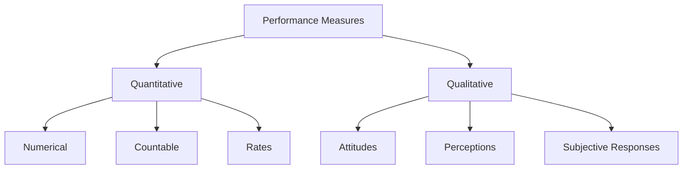
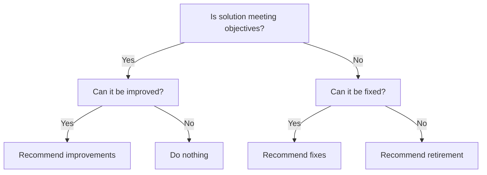

In this page, you'll learn:

- What solution evaluation is and why it's crucial
- How to measure solution performance
- Techniques for analyzing performance measures
- Methods for assessing solution and enterprise limitations
- How to recommend actions to increase solution value

## Welcome to the Solution Rodeo: Where We Separate the Broncos from the Mules!

Howdy, partner! You've just saddled up to the Solution Evaluation corral. This is where we separate the high-performing stallions from the stubborn old mules. Don't worry if you feel like you're trying to lasso a greased pig; by the end of this page, you'll be evaluating solutions like a seasoned ranch hand!

### What in Tarnation is Solution Evaluation?

Solution Evaluation is like being a judge at a county fair. You're assessing how well that prize pig (your solution) is performing, whether it's bringing home the bacon (value), and if it's worth keeping around or if it's time to send it to market.

BABOK® defines Solution Evaluation as the tasks that business analysts perform to assess the performance of and value delivered by a solution in use by the enterprise, and to recommend removal of barriers or constraints that prevent the full realization of the value.

**Remember:** Solution Evaluation isn't just for completed projects. You can (and should) evaluate solutions at various stages, from prototypes to fully operational systems.

## Measuring Solution Performance: Putting Your Solution on the Scale

Before you can judge how well your solution is performing, you need to weigh it. But unlike a pig at the county fair, you can't just plop your solution on a scale. You need to define and collect performance measures.

### Steps to Measure Solution Performance:

1. Define performance measures
2. Validate the measures with stakeholders
3. Collect the data

**Tip:** When collecting measures, consider the volume, frequency, and timing of your data collection. You don't want to base your judgments on a single pig when you've got a whole sty!

## Analyzing Performance Measures: Reading the Tea Leaves (or Pig Entrails)

Once you've collected your performance measures, it's time to make sense of them. This is where you put on your detective hat and look for clues about how well your solution is performing.

### Key Aspects to Analyze:

1. **Solution Performance vs. Desired Value**: Is your pig winning ribbons or just taking up space?
2. **Risks**: What could go wrong? (Besides everything)
3. **Trends**: Is performance improving over time or going downhill faster than a greased pig on a slide?
4. **Accuracy**: Are your measures telling the truth, the whole truth, and nothing but the truth?
5. **Performance Variances**: Where is performance different from what you expected?

**Remember:** Just because your pig is the biggest, doesn't mean it's the best. Look at all aspects of performance, not just the obvious ones.

## Assessing Solution Limitations: Finding Out Why Your Pig Won't Fly

Sometimes, your solution isn't delivering all the value it could. It's like having a pig that won't fly (okay, bad example - pigs aren't supposed to fly). But you get the idea. This is where you figure out what's holding your solution back.

### Steps to Assess Solution Limitations:

1. Identify internal solution component dependencies
2. Investigate solution problems
3. Assess the impact of these problems

| Problem            | Severity | Probability | Impact           | Action                  |
| ------------------ | -------- | ----------- | ---------------- | ----------------------- |
| Slow response time | High     | Frequent    | Users frustrated | Optimize database       |
| Data inaccuracy    | Medium   | Occasional  | Wrong decisions  | Improve data validation |
| System crashes     | High     | Rare        | Work stoppage    | Enhance error handling  |

**Warning:** Don't just focus on the squeaky wheels. Sometimes the quiet problems can be the most damaging in the long run.

## Assessing Enterprise Limitations: When It's Not the Pig, It's the Pen

Sometimes, the problem isn't with your solution - it's with the environment it's operating in. It's like having a prize-winning pig stuck in a tiny pen. This is where you look at how the enterprise itself might be limiting the solution's value.

### Areas to Assess:

1. **Enterprise Culture**: Is the organization ready for this solution?
2. **Stakeholder Impact**: How is the solution affecting different groups?
3. **Organizational Structure**: Does the current structure support or hinder the solution?
4. **Operational Assessment**: Are the right processes and tools in place?

**Try This:** Imagine your solution is a new high-tech tractor. Now think about what might stop it from being effective. Old, bumpy fields? Farmers who don't know how to use it? Not enough fuel? This is the kind of thinking you need to do when assessing enterprise limitations.

## Recommending Actions to Increase Solution Value: Fattening Up Your Pig

Now that you know how your solution is performing and what's holding it back, it's time to recommend how to make it better. This is where you put on your consultant hat and suggest ways to fatten up that pig (increase value).

### Possible Recommendations:

1. **Do Nothing**: Sometimes, the cost of change outweighs the benefits.
2. **Organizational Change**: Maybe the enterprise needs to adapt to get more value.
3. **Reduce Complexity**: Simplify interfaces or processes.
4. **Eliminate Redundancy**: Get rid of duplicate efforts.
5. **Identify Additional Capabilities**: Find hidden value in existing features.
6. **Retire the Solution**: Sometimes, it's time to send the pig to market.

**Remember:** Your job is to recommend, not decide. Provide clear, data-backed suggestions, but let the decision-makers do their job.

## Wrapping Up: You're Now a Solution Evaluation Cowboy!

Congratulations, partner! You've made it through the wild west of Solution Evaluation. You're now equipped to measure performance, analyze results, assess limitations, and recommend improvements like a pro.

Remember, Solution Evaluation isn't a one-and-done deal. It's an ongoing process, like tending to your prize-winning pig. Keep measuring, keep analyzing, and keep improving.

**Key Takeaways:**

- Measure solution performance using both quantitative and qualitative measures
- Analyze performance measures to understand how well the solution is delivering value
- Assess both solution and enterprise limitations
- Make clear, data-backed recommendations for improvement

Now, go forth and evaluate those solutions! And remember, in the world of business analysis, sometimes you have to kiss a lot of frogs before you find your prince - or in this case, evaluate a lot of pigs before you find your prize winner!
