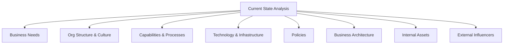
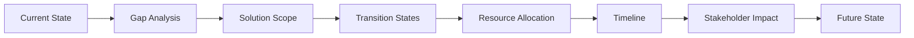

In this page, you'll learn:

- What strategy analysis is and why it's crucial in business analysis
- How to analyze the current state of a business
- Techniques for defining a compelling future state
- Methods for assessing risks in strategic planning
- How to craft an effective change strategy

## Welcome to the Strategy Saloon: Where Business Visions Come to Drink!

Howdy, partner! You've just moseyed into the Strategy Saloon, where we serve up the finest blend of business visioning this side of the Mississippi. Here, we don't just dream about the future; we saddle up and ride towards it. So grab your ten-gallon thinking hat, and let's wrangle some strategy!

### What in Tarnation is Strategy Analysis?

Strategy analysis is like being the sheriff of Businessville. You're not just keeping the peace day-to-day; you're planning how to make the town prosper in the long run. It's about figuring out where your business is now, where it wants to go, and how to get there without running into any bandits along the way.

BABOK® (that's the Business Analysis Body of Knowledge® for you greenhorns) defines strategy analysis as the work done to identify a business need, problem, or opportunity, address it, and define the best way forward.

**Remember:** Strategy analysis isn't just for big corporate bigwigs. Even if you're running a lemonade stand, you need a strategy. (Hint: Selling hot chocolate in summer might not be the best plan.)

## Analyzing the Current State: Taking Stock of Your Business Corral

Before you can plan where you're going, you need to know where you are. Analyzing the current state is like taking inventory of your ranch. What cattle do you have? How's the fence holding up? Is that old windmill still pumping water?

### Elements of Current State Analysis

1. **Business Needs:** What problems or opportunities is your business facing?
2. **Organizational Structure and Culture:** How's your posse organized? Are they all singing from the same hymn sheet?
3. **Capabilities and Processes:** What can your business do, and how does it do it?
4. **Technology and Infrastructure:** What tools are you working with?
5. **Policies:** What rules are governing your business rodeo?
6. **Business Architecture:** How do all these parts fit together?
7. **Internal Assets:** What resources do you have in your saddlebags?
8. **External Influencers:** What's happening outside your ranch that might affect your business?

**Tip:** Don't just rely on what the trail boss tells you. Talk to the cowboys, the cooks, and even the horses (okay, maybe not the horses). Everyone has a unique perspective on the current state.

## Defining the Future State: Dreaming Up Your Business Bonanza

Now that you know where you are, it's time to figure out where you want to go. Defining the future state is like planning the route for your cattle drive. Where's the best grazing land? What rivers do we need to cross? How do we avoid those pesky rustlers?

### Key Components of Future State Definition

1. **Business Goals and Objectives:** What do you want to achieve? Make 'em SMART (Specific, Measurable, Achievable, Relevant, Time-bound)!
2. **Scope of Solution Space:** What kinds of solutions are we considering?
3. **Constraints:** What's holding us back? (Besides that darned ol' gravity)
4. **Potential Value:** What's the payoff if we strike gold?

**Warning:** Don't get so starry-eyed about the future that you forget about reality. A future state of "we'll all be billionaires living on Mars" might be a tad unrealistic. Unless you're Elon Musk. Are you Elon Musk?

## Assessing Risks: Watching Out for Business Rattlesnakes

Every great adventure has its dangers, and your business journey is no different. Assessing risks is like checking your boots for scorpions before you put them on. It's better to find them before they find you!

### Risk Assessment Steps

1. **Identify Risks:** What could go wrong? (Besides everything)
2. **Analyze Impact:** If it does go wrong, how bad would it be?
3. **Estimate Likelihood:** What are the chances of it happening?
4. **Determine Risk Level:** Combine impact and likelihood
5. **Plan Responses:** How will you deal with it if it happens?

| Likelihood / Impact | Low Impact  | Medium Impact | High Impact |
| ------------------- | ----------- | ------------- | ----------- |
| High Likelihood     | Medium Risk | High Risk     | High Risk   |
| Medium Likelihood   | Low Risk    | Medium Risk   | High Risk   |
| Low Likelihood      | Low Risk    | Low Risk      | Medium Risk |

**Remember:** Not all risks are bad. Sometimes, what looks like a rattlesnake turns out to be a lasso. Look for opportunities hiding in those risks!

## Defining Change Strategy: Charting Your Course to the Promised Land

You know where you are, where you want to go, and what dangers lie ahead. Now it's time to plot your course. Defining a change strategy is like planning your route through the Wild West. Do we take the mountain pass or the desert route? Do we ford the river or build a raft?

### Elements of a Solid Change Strategy

1. **Gap Analysis:** What's the difference between where we are and where we want to be?
2. **Solution Scope:** What exactly are we changing?
3. **Transition States:** What pit stops do we need to make along the way?
4. **Resource Allocation:** What supplies do we need for the journey?
5. **Timeline:** When do we want to reach our destination?
6. **Stakeholder Impact:** How will this affect everyone in our wagon train?

**Tip:** Your change strategy isn't set in stone. Be ready to adjust your course if you run into a canyon or a gold mine along the way.

## Wrapping Up: You're Now a Strategy Sheriff!

Congratulations, partner! You've made it through the wild frontier of strategy analysis. You're now equipped to assess your current state, envision a bright future, dodge those pesky risks, and chart a course to business success.

Remember, strategy analysis isn't a one-and-done deal. It's an ongoing process, like tending to your ranch. Keep your eyes on the horizon, but don't forget to watch where you're stepping.

**Key Takeaways:**

- Understand your current state before planning your future
- Dream big for your future state, but keep it grounded in reality
- Always be on the lookout for risks (and opportunities)
- Your change strategy is your roadmap to success - but be ready to take detours

Now, go forth and strategize! And remember, in the wild west of business, the quick thinker outdraws the quick shooter every time. Happy trails!
