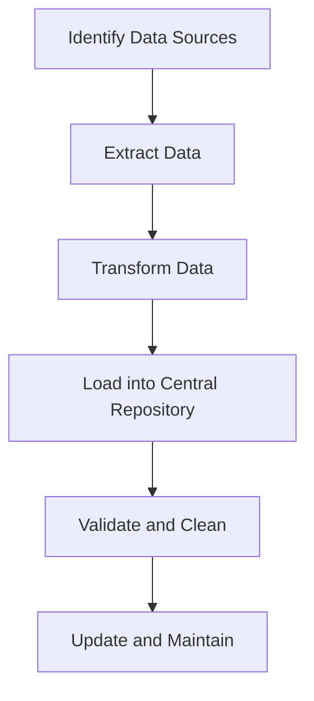
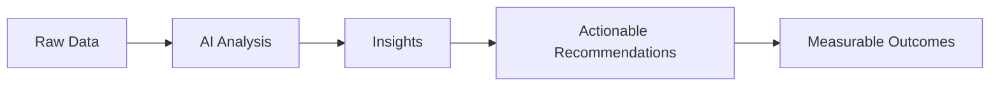

Welcome back, data enthusiasts! In our last page, we dipped our toes into the world of AI in business analysis. Now, we're going to dive deeper into how AI is revolutionizing data analysis and generating mind-blowing insights. Buckle up, because we're about to turbocharge your data game!

## The Big Picture: Why AI-Driven Data Analysis?

Before we get into the nitty-gritty, let's take a step back and look at why AI-driven data analysis is such a big deal.

🧠 **Think about it:** Imagine you're trying to find a needle in a haystack. That's what traditional data analysis often feels like. Now, imagine you have a super-smart robot that can sort through the hay at lightning speed and even tell you what the needle is made of. That's AI-driven data analysis in a nutshell!

### Benefits of AI in Data Analysis:

1. **Speed:** AI can process vast amounts of data in seconds.
2. **Pattern Recognition:** AI can spot trends and patterns humans might miss.
3. **Predictive Power:** AI can forecast future trends based on historical data.
4. **Automation:** AI can handle repetitive tasks, freeing up humans for more strategic thinking.
5. **Scalability:** AI systems can easily scale to handle growing data volumes.

Now that we know why AI is a game-changer, let's dive into the key areas where it's making waves.

## Centralizing Data: Building Your Data Fortress

Ever felt like your data is scattered across a million different places? You're not alone! One of the biggest challenges in AI-driven data analytics is bringing all that fragmented data together.

### The Data Centralization Process:

💡 **Pro Tip:** Think of data centralization like organizing your closet. First, you gather all your clothes (data) from different places. Then, you sort them (transform), put them in your closet (central repository), make sure everything's clean and in the right place (validate and clean), and regularly tidy up (update and maintain).

### Why Centralize?

- **Comprehensive View:** See the big picture of your business
- **Consistency:** Ensure everyone's working with the same data
- **Efficiency:** Spend less time hunting for data and more time analyzing it
- **Better Insights:** More complete data leads to more accurate insights

🚨 **Warning:** Centralizing data can be a big undertaking. Start small, focus on your most critical data sources first, and gradually expand.

## Qualitative Data Analysis: Getting to the "Why"

Numbers are great, but they don't tell the whole story. That's where qualitative data comes in. It's all about understanding the "why" behind the "what."

### Qualitative vs. Quantitative Data:

| Aspect              | Qualitative Data                    | Quantitative Data           |
| ------------------- | ----------------------------------- | --------------------------- |
| Nature              | Descriptive                         | Numerical                   |
| Question It Answers | Why? How?                           | How many? How much?         |
| Example             | Customer feedback comments          | Number of website visits    |
| Analysis Method     | Thematic analysis, content analysis | Statistical analysis        |
| AI Application      | Natural Language Processing (NLP)   | Machine Learning algorithms |

### How AI Boosts Qualitative Analysis:

1. **Sentiment Analysis:** AI can determine if feedback is positive, negative, or neutral.
2. **Topic Modeling:** AI can identify common themes in large text datasets.
3. **Entity Recognition:** AI can pick out important names, places, or concepts in text.
4. **Language Translation:** AI can analyze feedback in multiple languages.

💡 **Pro Tip:** When analyzing qualitative data, use AI to do the heavy lifting, but always have a human review the results. AI might miss nuances or context that humans can easily spot.

## Actionable Insights: From Data to Decisions

Alright, you've got your data centralized and analyzed. Now what? It's time to turn those insights into action!

### The Actionable Insights Formula:

### Making Insights Actionable:

1. **Be Specific:** "Improve customer service" is vague. "Reduce response time to customer queries by 20%" is actionable.
2. **Provide Context:** Explain why the insight matters and how it relates to business goals.
3. **Suggest Next Steps:** Don't just present the data, recommend actions based on it.
4. **Make it Measurable:** Include metrics to track the impact of actions taken.

🎭 **Try This:** Take a recent insight from your data analysis. Now, challenge yourself to turn it into an actionable recommendation using the formula above. How specific and measurable can you make it?

## Real-Time Analytics and Customization: The Dynamic Duo

In today's fast-paced world, waiting days for insights is so last century. Real-time analytics and customization are the new black!

### Benefits of Real-Time Analytics:

- **Immediate Response:** React to trends as they happen
- **Proactive Problem-Solving:** Identify issues before they escalate
- **Dynamic Decision Making:** Adjust strategies on the fly

### Customization Features to Look For:

1. **Personalized Dashboards:** Let users choose what metrics matter most to them
2. **Flexible Reporting:** Allow users to create custom reports on the fly
3. **Adjustable Algorithms:** Enable tweaking of AI models for specific business needs
4. **API Integration:** Make it easy to connect with other tools and data sources

💡 **Pro Tip:** When choosing an AI-driven analytics tool, prioritize those that offer both real-time capabilities and high levels of customization. Your future self will thank you!

## Community Feedback and Collaboration: The Secret Sauce

Remember, you're not on this AI journey alone! Tapping into community feedback and fostering collaboration can take your AI-driven analysis to the next level.

### Ways to Leverage Community:

1. **User Forums:** Create a space for users to share tips and ask questions
2. **Beta Testing:** Involve enthusiastic users in testing new features
3. **Idea Boards:** Let users suggest and vote on new features
4. **Collaborative Datasets:** In some industries, pooling anonymized data can lead to richer insights

🎭 **Try This:** Start a "Data Analysis Challenge" in your organization. Encourage teams to use AI tools to analyze a common dataset and present their insights. You'll be amazed at the creative approaches people come up with!

## Wrapping Up: Your AI-Driven Data Analysis Toolkit

Congratulations! You're now equipped with the knowledge to supercharge your data analysis with AI. Let's recap the key points:

1. **Centralize Your Data:** Build your data fortress for comprehensive insights
2. **Embrace Qualitative Analysis:** Use AI to understand the "why" behind the numbers
3. **Focus on Actionable Insights:** Turn data into decisions
4. **Leverage Real-Time Analytics:** Stay ahead of the curve with immediate insights
5. **Customize Your Tools:** Tailor your analytics to your specific needs
6. **Engage Your Community:** Collaborate for better insights and tools

Remember, AI is a powerful ally in data analysis, but it's not a magic wand. Always apply critical thinking, consider ethical implications, and keep the human touch in your analysis.
