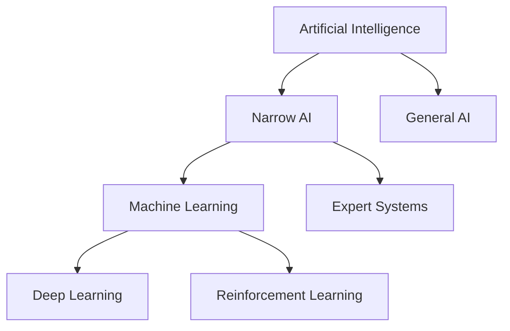
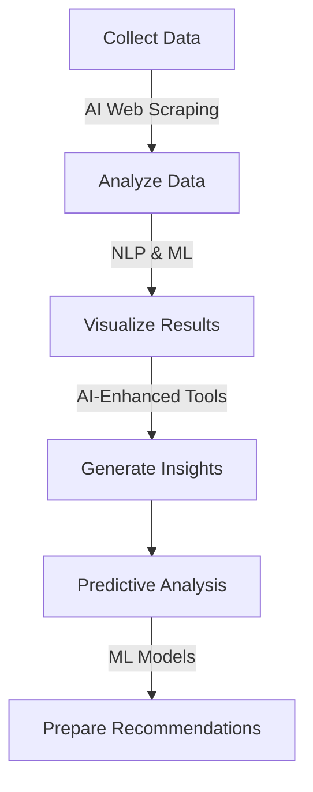

Welcome to the exciting world where artificial intelligence (AI) meets business analysis (BA)! In this page, we're going to demystify AI and show you how it's revolutionizing the field of business analysis. Don't worry if you're not a tech whiz – we'll break everything down into bite-sized, easy-to-digest pieces. So, grab your favorite beverage, get comfy, and let's dive in!

## What on Earth is AI, Anyway?

Before we jump into how AI is shaking things up in business analysis, let's get our heads around what AI actually is.

**AI in a Nutshell:** Artificial Intelligence is like giving computers a brain. It's the ability of machines to mimic human intelligence – things like learning, problem-solving, and decision-making.

### Types of AI:

1. **Narrow AI:** This is the kind of AI we interact with daily. It's designed for specific tasks, like Siri answering your questions or Netflix recommending movies.

2. **General AI:** This is the sci-fi stuff – AI that can think and reason like humans across any task. We're not quite there yet, but trust me will be soon!

3. **Machine Learning:** A subset of AI where machines learn from data without being explicitly programmed. It's like teaching a computer to recognize cats by showing it thousands of cat pictures.

4. **Deep Learning:** A more complex form of machine learning, inspired by the human brain's neural networks. It's great for tasks like image and speech recognition.

<Note>
  **Remember:** When we talk about AI in business analysis, we're usually
  referring to narrow AI and machine learning applications.
</Note>
## Why Should Business Analysts Care About AI?

You might be thinking, "Okay, AI sounds cool, but what's it got to do with my job as a business analyst?" Great question! AI is transforming the way we do business analysis in some pretty awesome ways:

1. **Supercharged Data Analysis:** AI can crunch through massive datasets in seconds, uncovering insights that might take humans days or weeks to find.

2. **Predictive Power:** AI algorithms can forecast trends and outcomes, helping you make data-driven recommendations.

3. **Automation of Repetitive Tasks:** AI can take care of time-consuming, routine tasks, freeing you up to focus on high-value analysis.

4. **Enhanced Decision Making:** AI-powered tools can provide real-time insights to support better decision-making.

5. **Improved Customer Understanding:** AI can analyze customer behavior patterns, helping you to identify needs and pain points more accurately.

## AI Tools for Business Analysts

Now that we know why AI matters, let's look at some cool AI tools that can make your life as a business analyst easier:

| Tool Type                   | Example         | What it Does                                              |
| --------------------------- | --------------- | --------------------------------------------------------- |
| Data Analysis               | Tableau with AI | Creates visualizations and uncovers patterns in your data |
| Predictive Analytics        | IBM Watson      | Forecasts trends and outcomes based on historical data    |
| Process Mining              | Celonis         | Analyzes business processes to identify inefficiencies    |
| Natural Language Processing | GPT             | Helps in generating reports or analyzing text data        |
| Chatbots                    | Vapi            | Automates customer interactions and gathers insights      |

🚨 **Warning:** While these tools are powerful, remember they're not magic. Always apply critical thinking to AI-generated insights!

## How to Use AI in Your BA Workflow

Let's walk through a simple example of how you might use AI in your day-to-day work as a business analyst.

**Scenario:** You're analyzing customer feedback for a new product launch.

1. **Data Collection:** Use AI-powered web scraping tools to gather customer reviews from various online platforms.

2. **Data Analysis:**

   - Feed the collected data into a natural language processing (NLP) tool.
   - The AI analyzes sentiment, identifies common themes, and highlights key issues.

3. **Visualization:** Use an AI-enhanced visualization tool to create interactive dashboards showing the analysis results.

4. **Insights Generation:** Based on the AI analysis, identify the top 3 product issues and 3 most appreciated features.

5. **Predictive Analysis:** Use a machine learning model to forecast potential impact on sales if the top issues are addressed.

6. **Recommendation:** Prepare a data-backed recommendation for the product team, supported by AI-generated insights.

## Ethical Considerations: The AI Elephant in the Room

As exciting as AI is, it's not all rainbows and unicorns. There are some important ethical considerations to keep in mind:

1. **Data Privacy:** AI needs data to learn, but how much is too much? Always ensure you're complying with data protection regulations.

2. **Bias in AI:** If your training data is biased, your AI will be too. Be aware of potential biases in your AI tools and data sources.

3. **Transparency:** Can you explain how your AI-powered insights were generated? Transparency is key for building trust.

4. **Job Displacement:** While AI can enhance BA work, it's also changing the job market. Stay updated on AI trends to future-proof your career.

5. **Overreliance on AI:** Remember, AI is a tool, not a replacement for human judgment. Always apply critical thinking to AI-generated insights.

💡 **Tip:** Regularly discuss ethical AI use in your organization. Consider creating an "AI Ethics Checklist" for your BA projects.

## Try This: Your First AI-Powered BA Project

Ready to dip your toes into the AI waters? Here's a mini-project to get you started:

1. Choose a free AI-powered text analysis tool (e.g., Chatgpt, Claude, Gemini).
2. Gather 50-100 customer reviews for a product or service you're familiar with.
3. Use the AI tool to analyze sentiment and identify common themes in the reviews.
4. Create a simple visualization of your findings (a word cloud or bar chart will do).
5. Based on the AI analysis, write a short (1-2 paragraph) recommendation for improving the product or service.

## Wrapping Up: The Future is AI + Human Intelligence

As we've seen, AI is not replacing business analysts – it's empowering them. By embracing AI tools and techniques, you can supercharge your analytical capabilities and provide even more value to your organization.

Remember, the most powerful combination is AI + human intelligence. AI can crunch the numbers and spot patterns, but it's your human creativity, critical thinking, and domain knowledge that will turn those insights into game-changing strategies.

So, are you ready to become an AI-savvy business analyst? The future is waiting – let's go analyze it!

**📚 Further Reading:**

- "Why AI Is a Business Analyst’s Best Friend?" by Denis Ivanov
- "How AI Is Revolutionizing The Role Of The Business Analyst" by Michael Amori
