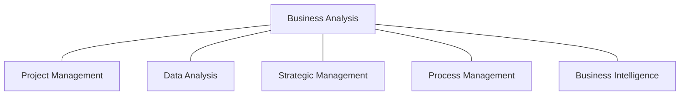
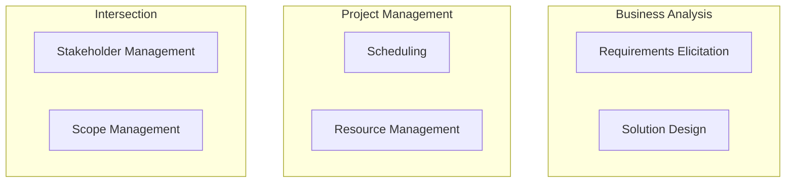
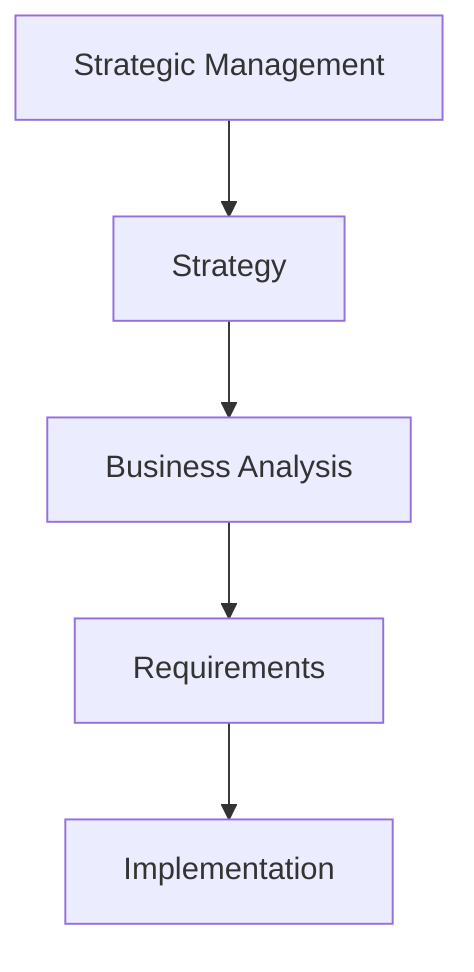
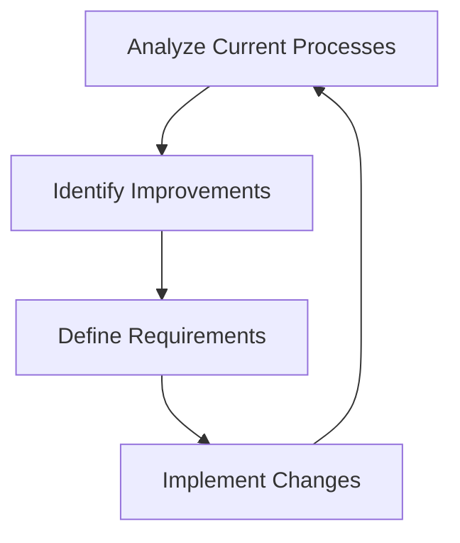
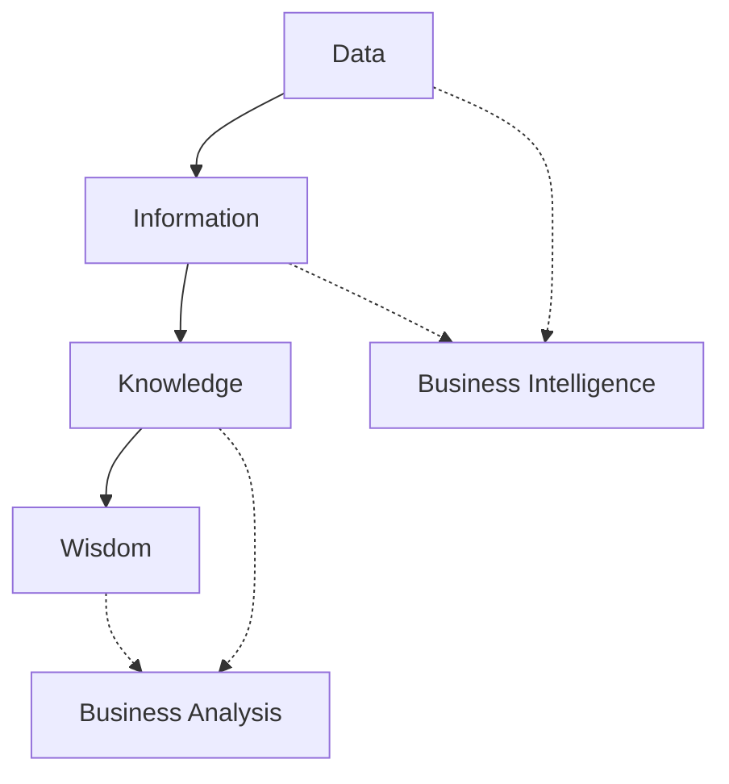

Welcome back, BA explorers! In our last page, we charted the course of a BA career. Now, it's time to meet the neighbors. Business Analysis doesn't exist in a vacuum – it's part of a rich ecosystem of related fields. Let's explore how BA interacts with its professional cousins and see where the boundaries blur and where they stay crisp.

## The Professional Neighborhood: A Bird's Eye View

Before we dive into the details, let's get a bird's eye view of our professional neighborhood. Here's a diagram showing how Business Analysis relates to other fields:

As you can see, Business Analysis is at the center, connected to all these related fields. But what do these connections really mean? Let's break it down.

## Business Analysis and Project Management: The Dynamic Duo

If Business Analysis and Project Management were superheroes, they'd be Batman and Robin – a dynamic duo working together to save the day (or in this case, deliver successful projects).

### Similarities:

- Both focus on delivering value to the organization
- Both require excellent communication and stakeholder management skills
- Both involve planning and monitoring progress

### Differences:

- BAs focus on 'what' and 'why', PMs focus on 'how' and 'when'
- BAs dive deep into requirements, PMs oversee the entire project lifecycle
- BAs are more involved in the solution design, PMs in resource management

### Intersection:

The sweet spot where BA and PM meet is in ensuring that the project delivers the right solution to the right problem.

> "The BA role complements project management by ensuring that the right things are built, while project management ensures things are built right." - Karl Wiegers, author of "Software Requirements"

**Try This:** Next time you're in a project meeting, notice how the BA and PM roles interact. How do they support each other? Where do their responsibilities overlap?

## Business Analysis and Data Analysis: The Detail Detectives

If BAs and Data Analysts were detectives, BAs would be Sherlock Holmes (looking at the big picture) and Data Analysts would be forensic scientists (diving deep into the data).

### Similarities:

- Both involve analyzing information to draw conclusions
- Both require critical thinking and problem-solving skills
- Both aim to provide insights that drive decision-making

### Differences:

- BAs focus on business processes and stakeholder needs, DAs focus on datasets and statistical analysis
- BAs often work with qualitative data, DAs primarily work with quantitative data
- BAs create requirements and process models, DAs create data models and visualizations

### Intersection:

BAs and DAs often collaborate to turn data insights into actionable business recommendations.

| Aspect               | Business Analysis                        | Data Analysis                            |
| -------------------- | ---------------------------------------- | ---------------------------------------- |
| Focus                | Business processes and stakeholder needs | Datasets and statistical analysis        |
| Primary Skills       | Communication, process modeling          | Statistical analysis, data visualization |
| Typical Deliverables | Requirements documents, process models   | Data models, statistical reports         |
| Tools                | BPMN, UML                                | SQL, R, Python                           |
| Key Question         | "What does the business need?"           | "What does the data tell us?"            |

**Tech Talk:** As data becomes increasingly crucial in decision-making, many BAs are upskilling in data analysis techniques. Being able to understand and interpret data can make you a more effective BA!

## Business Analysis and Strategic Management: The Vision Shapers

If Business Analysis and Strategic Management were on a ship, Strategic Management would be at the helm, setting the course, while Business Analysis would be in the engine room, figuring out how to get there.

### Similarities:

- Both are concerned with improving organizational performance
- Both require a deep understanding of the business and its environment
- Both involve analyzing current state and envisioning future state

### Differences:

- Strategic Management sets the overall direction, BA figures out how to implement it
- Strategic Management has a longer-term focus, BA often deals with shorter-term projects
- Strategic Management is more concerned with competitive positioning, BA with internal processes and systems

### Intersection:

BAs often support strategic initiatives by translating high-level strategies into concrete projects and requirements.

> "Business Analysts are the bridge between strategic vision and tactical execution." - Laura Brandenburg, founder of Bridging the Gap

## Business Analysis and Process Management: The Efficiency Experts

Business Analysis and Process Management are like two sides of the same coin – both are all about making businesses run better, just from slightly different angles.

### Similarities:

- Both focus on improving business operations
- Both involve mapping and analyzing business processes
- Both aim to increase efficiency and effectiveness

### Differences:

- BAs often focus on how processes interact with systems, PMs focus more on the processes themselves
- BAs might look at processes as part of a larger project, PMs often engage in continuous process improvement
- BAs create requirements for new systems or changes, PMs might implement changes directly

### Intersection:

BAs often use process management techniques in their work, especially when analyzing the current state of a business.

**Try This:** Pick a simple process in your daily life (like making coffee or getting ready for work). Try mapping it out as a process flow. Then put on your BA hat – what requirements would you write to improve this process?

## Business Analysis and Business Intelligence: The Insight Generators

Business Analysis and Business Intelligence are like two explorers in the jungle of business data – BA is looking for paths forward, while BI is mapping the terrain.

### Similarities:

- Both aim to provide insights that drive business decisions
- Both require a strong understanding of business operations
- Both involve analyzing business data

### Differences:

- BAs focus more on future states and changes, BI focuses more on understanding current and past performance
- BAs often work on specific projects or initiatives, BI provides ongoing operational insights
- BAs might use BI tools and reports as inputs to their analysis

### Intersection:

BAs often use BI insights to inform their requirements and recommendations, while BI teams might work with BAs to understand what new data or reports are needed.

**Tech Talk:** The line between BA and BI is becoming increasingly blurred with the rise of self-service BI tools. As a BA, familiarizing yourself with tools like Power BI or Tableau can be a significant career boost!

## The Bottom Line: Jack of All Trades, Master of One

As we've seen, Business Analysis has connections to many other fields. This is both a challenge and an opportunity. On one hand, it means BAs need to be versatile and able to speak multiple professional "languages". On the other hand, it opens up numerous paths for career growth and specialization.

Remember, the goal isn't to become an expert in all these fields. Instead, aim to:

1. Understand the basics of each related field
2. Know how to collaborate effectively with professionals in these areas
3. Recognize when to bring in specialists from these fields

> "The best Business Analysts are those who can see the connections between different areas of the business and bring them together to solve problems." - Kevin Brennan, former Chief Business Analyst and EVP at IIBA

In our next page, we'll put all this knowledge into practice with some real-world BA case studies. Get ready to see how BAs navigate this complex professional ecosystem to deliver value!

**Remember:** Your unique combination of skills and interests will shape your BA career. Some BAs lean more towards the technical side, others towards the strategic. Embrace your strengths and keep learning – that's the BA way!
