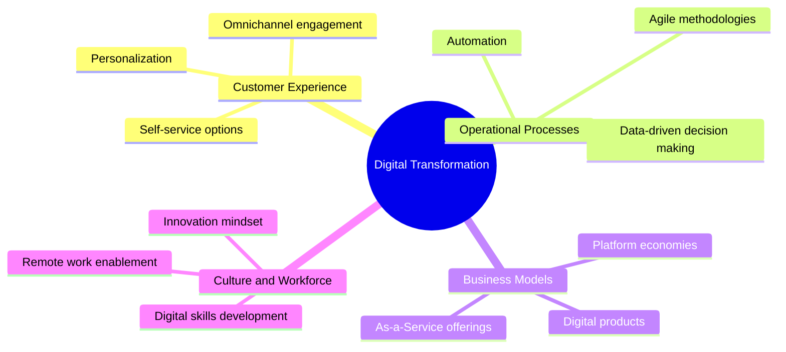
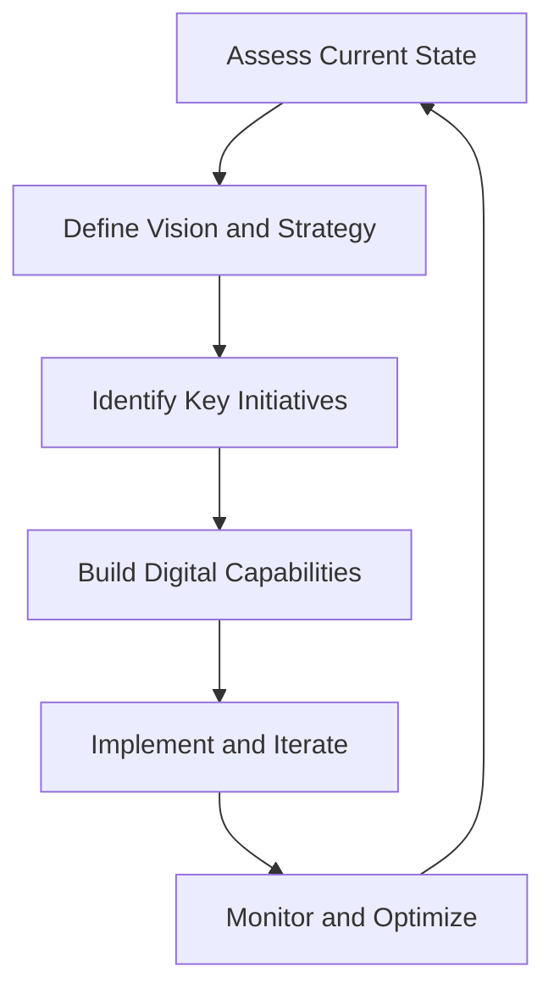

Welcome, future-focused business analysts! In our previous pages, we've explored the power of AI and data analysis. Now, it's time to zoom out and look at the bigger picture: Digital Transformation. Buckle up, because we're about to embark on a journey that's reshaping the business world as we know it!

## What's All This Digital Transformation Buzz About?

🧠 **Think about it:** Remember when phones were just for calling people? Now they're mini-computers in our pockets. That's digital transformation on a personal scale. In business, it's about leveraging technology to fundamentally change how you operate and deliver value to customers.

### Digital Transformation in a Nutshell:

- It's not just about adopting new tech
- It's about rethinking business models
- It focuses on improving customer experiences
- It requires a culture of innovation and adaptability

💡 **Pro Tip:** Digital transformation isn't a one-time project. It's an ongoing journey of continuous improvement and adaptation.

## The Digital Transformation Landscape

Let's break down the key areas where digital transformation is making waves:

## Technologies Driving Digital Transformation

Now that we've got the big picture, let's look at some of the key technologies fueling this digital revolution:

| Technology               | Description                              | Business Impact                             |
| ------------------------ | ---------------------------------------- | ------------------------------------------- |
| Cloud Computing          | On-demand computing resources            | Scalability, cost-efficiency                |
| Internet of Things (IoT) | Connected devices and sensors            | Real-time data, smart operations            |
| Artificial Intelligence  | Machine learning and intelligent systems | Automation, predictive analytics            |
| Blockchain               | Decentralized, secure ledger             | Transparency, secure transactions           |
| 5G Networks              | High-speed, low-latency connectivity     | Enhanced mobile experiences, IoT enablement |

🎭 **Try This:** Think about your organization or a company you're familiar with. Which of these technologies could have the biggest impact? How might they change the way business is done?

## The Business Analyst's Role in Digital Transformation

As a business analyst, you're in a unique position to drive digital transformation. Here's how you can make a difference:

1. **Bridge the Gap:** You're the translator between tech teams and business stakeholders.
2. **Identify Opportunities:** Use your analytical skills to spot areas ripe for digital innovation.
3. **Manage Change:** Help your organization navigate the cultural shifts that come with digital transformation.
4. **Measure Impact:** Develop KPIs to track the success of digital initiatives.

💡 **Pro Tip:** Develop a "digital-first" mindset. Always ask, "How can technology improve this process or experience?"

## The Digital Transformation Process: A Step-by-Step Guide

Ready to embark on your digital transformation journey? Here's a roadmap to get you started:

1. **Assess Current State:**
   - Conduct a digital maturity assessment
   - Identify pain points and opportunities
2. **Define Vision and Strategy:**
   - Align digital goals with business objectives
   - Get buy-in from leadership
3. **Identify Key Initiatives:**
   - Prioritize projects based on impact and feasibility
   - Create a roadmap with clear milestones
4. **Build Digital Capabilities:**
   - Invest in necessary technologies
   - Upskill workforce and hire new talent
5. **Implement and Iterate:**
   - Start with pilot projects
   - Use agile methodologies for quick wins
6. **Monitor and Optimize:**
   - Track KPIs and gather feedback
   - Continuously refine your approach

🚨 **Warning:** Digital transformation isn't a "set it and forget it" process. Be prepared for ongoing adjustments and iterations.

## Overcoming Digital Transformation Challenges

Let's face it: digital transformation isn't all smooth sailing. Here are some common challenges and how to tackle them:

1. **Resistance to Change:**

   - Solution: Focus on change management. Communicate benefits clearly and involve employees in the process.

2. **Legacy Systems:**

   - Solution: Develop a phased approach to modernization. Consider APIs to connect old and new systems.

3. **Skill Gaps:**

   - Solution: Invest in training programs. Partner with educational institutions or consider hiring digital natives.

4. **Data Security Concerns:**

   - Solution: Make cybersecurity a top priority. Implement robust security measures and educate employees on best practices.

5. **Lack of Clear Strategy:**
   - Solution: Start with a clear vision and measurable goals. Align digital initiatives with overall business objectives.

💡 **Pro Tip:** Create a "Digital Transformation Task Force" with representatives from different departments to address challenges collaboratively.

## Case Study: Digital Transformation Success

Let's look at a real-world example of successful digital transformation:

**Company:** Domino's Pizza
**Challenge:** Declining sales and poor customer perception
**Solution:** Embraced digital technology to revolutionize ordering and customer experience

**Key Initiatives:**

- Developed a user-friendly mobile app and website for easy ordering
- Implemented a pizza tracker for real-time order updates
- Used data analytics to personalize offers and improve operations
- Experimented with innovative delivery methods (e.g., drone delivery)

**Results:**

- Stock price increased over 2000% in less than a decade
- Became the largest pizza company in the world by global retail sales
- Significantly improved customer satisfaction and loyalty

🎭 **Try This:** Think of a traditional business in your local area. How could they apply digital transformation principles to improve their operations or customer experience?

## Wrapping Up: Your Digital Transformation Toolkit

Congratulations! You're now equipped with the knowledge to drive digital transformation in your organization. Let's recap the key points:

1. **Understand the Landscape:** Digital transformation touches every aspect of business.
2. **Leverage Key Technologies:** Cloud, IoT, AI, Blockchain, and 5G are reshaping industries.
3. **Follow the Process:** Assess, strategize, implement, and continuously improve.
4. **Overcome Challenges:** Be prepared for resistance and focus on change management.
5. **Learn from Success Stories:** Look to companies like Domino's for inspiration.
6. **Stay Adaptable:** Digital transformation is an ongoing journey, not a destination.

Remember, as a business analyst, you're at the forefront of this digital revolution. Embrace the change, drive innovation, and always keep the human element in mind. Technology is a tool, but people are at the heart of successful digital transformation.

📚 **Further Reading:**

- "Leading Digital: Turning Technology into Business Transformation" by George Westerman, Didier Bonnet, and Andrew McAfee
- "The Digital Transformation Playbook" by David L. Rogers
- "Digital Transformation: Survive and Thrive in an Era of Mass Extinction" by Thomas M. Siebel
