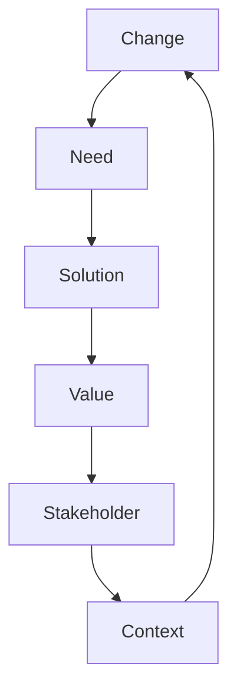

Welcome back, BA adventurers! In our last page, we explored how Business Analysis plays nice with its professional neighbors. Now, it's time to dive into the heart of BA itself. Buckle up, because we're about to unpack the Swiss Army knife of Business Analysis: The Business Analysis Core Concept Model, or BACCM™ for short (because who doesn't love a good acronym?).

## What in the World is BACCM™?

Imagine you're packing for a camping trip. You'd want a tool that can do it all, right? Something that can open cans, cut rope, and maybe even remove splinters. That's what the BACCM™ is for Business Analysis – a multi-tool that helps you tackle any BA challenge.

The BACCM™, introduced by the International Institute of Business Analysis (IIBA), is a conceptual framework that defines the essence of Business Analysis. It's like the DNA of BA, containing six core concepts that are present in every BA task, no matter how big or small.

> "The BACCM™ provides a conceptual framework for all business analysis, regardless of the perspective, level of detail, or particular type of analysis to be performed." - IIBA BABOK Guide v3

## The Six Musketeers of BACCM™

Let's meet our heroes, shall we? The BACCM™ consists of six core concepts:

1. Change
2. Need
3. Solution
4. Stakeholder
5. Value
6. Context

Think of these concepts as the six musketeers of Business Analysis – all for one and one for all!

<Note>
  **Tech Talk:** The BACCM™ isn't just theoretical fluff. It's baked into the
  structure of the BABOK Guide (Business Analysis Body of Knowledge),
  influencing how BAs approach every task and technique.
</Note>

## Breaking Down the BACCM™: One Concept at a Time

Let's dive into each concept and see how they work in the real world.

### 1. Change: The Only Constant in Business

Change is what keeps BAs employed. It's the spark that ignites every project and the force that shapes businesses.

<Info>
  **Real-World Example:** Imagine a local bakery deciding to start online
  ordering. That's a change that would require some serious BA work!
</Info>
<Tip>
  **Try This:** Think about a recent change in your personal or professional
  life. How did it create needs? What solutions did you implement?
</Tip>
### 2. Need: The Itch That Needs Scratching

Needs are the gaps between the current state and the desired state. They're what drive change and justify projects.

**Real-World Example:** In our bakery scenario, the need might be to increase sales by reaching customers who can't visit the physical store.

**Remember:** Not all needs are created equal. Part of your job as a BA is to prioritize needs based on their importance and feasibility.

### 3. Solution: The Hero of Our Story

Solutions are how we address needs and implement change. They can be products, services, or even changes to existing processes.

<Info>
  **Real-World Example:** For our bakery, the solution might be a new e-commerce
  website and a process for fulfilling online orders.
</Info>
<Warning>
  **Warning:** Don't fall in love with a solution too quickly! Make sure you
  fully understand the need before jumping to solutions.
</Warning>
### 4. Stakeholder: The Cast of Characters

Stakeholders are anyone who has a stake in the change, need, or solution. They're the characters in your BA story.

**Real-World Example:** For our bakery's online ordering project, stakeholders might include the bakery owner, employees, customers, and even the IT consultant building the website.

| Stakeholder Type       | Description                     | Example          |
| ---------------------- | ------------------------------- | ---------------- |
| Primary                | Directly impacted by the change | Bakery employees |
| Secondary              | Indirectly impacted             | Bakery suppliers |
| Key                    | Have significant influence      | Bakery owner     |
| Subject Matter Experts | Provide specialized knowledge   | IT consultant    |

<Tip>
  **Try This:** For your next project, try creating a stakeholder map. Who are
  the key players? Who might be impacted that you haven't considered?
</Tip>
### 5. Value: The Pot of Gold at the End of the Rainbow

Value is the benefit that stakeholders get from a solution. It's why we do what we do.

<Info>
  **Real-World Example:** For our bakery, value might be increased revenue,
  happier customers, or a competitive edge over other local bakeries.
</Info>

> "The best BAs don't just deliver solutions; they deliver value." - Laura Brandenburg,
> founder of Bridging the Gap

**Tech Talk:** Measuring value can be tricky. Look into concepts like Return on Investment (ROI) and Key Performance Indicators (KPIs) to quantify the value of your projects.

### 6. Context: The Stage for Our BA Drama

Context is the setting in which business analysis happens. It includes things like organizational culture, market conditions, and regulatory environment.

<Info>
  **Real-World Example:** For our bakery, the context might include local food
  safety regulations, the competitive landscape of local bakeries, and the
  general trend towards online shopping.
</Info>

<Note>
  **Remember:** Context can make or break a project. A solution that works
  brilliantly in one context might fail miserably in another.
</Note>
## Putting It All Together: The BACCM™ in Action

Now that we've met our six musketeers, let's see how they work together in a real BA scenario.

**Step-by-Step Guide: Applying the BACCM™ to a Project**

1. Identify the Change: Online ordering system for a local bakery
2. Understand the Need: Increase sales by reaching new customers
3. Develop the Solution: E-commerce website and order fulfillment process
4. Engage Stakeholders: Bakery owner, employees, customers, IT consultant
5. Define Value: Increased revenue, customer satisfaction, competitive advantage
6. Consider Context: Food safety regulations, local competition, online shopping trends

By considering all six concepts, you ensure that your BA work is comprehensive and aligned with business goals.

<Info>
  **Industry Insight:** "I once worked on a project where we had a great
  solution, but we didn't fully consider the organizational context," shares
  Maria Rodriguez, a senior BA at a Fortune 500 company. "The solution met all
  the technical requirements, but it clashed with the company culture. We had to
  go back to the drawing board and redesign with the context in mind. It taught
  me the importance of considering all aspects of the BACCM™ from the start."
</Info>
## The BACCM™: Your Career Secret Weapon

Understanding and applying the BACCM™ can give your BA career a serious boost. Here's how:

1. **Job Interviews:** Use the BACCM™ to structure your answers to interview questions. It shows you understand the holistic nature of BA work.

2. **Project Pitches:** Frame your project proposals using the six concepts. It ensures you've covered all bases and impresses stakeholders.

3. **Problem Solving:** When faced with a tricky business problem, run through the six concepts. It can help you see angles you might have missed.

<Tip>
  **Career Tip:** Add "BACCM™" to your resume skills section. It's a great
  talking point in interviews and shows you're up-to-date with BA best
  practices.
</Tip>
## The Bottom Line: BACCM™ Your Way to BA Success

The BACCM™ isn't just some dry theoretical model. It's a powerful tool that can help you navigate the complex world of Business Analysis. By considering Change, Need, Solution, Stakeholder, Value, and Context in every project, you ensure that your BA work is comprehensive, valuable, and aligned with business goals.

Remember, like any tool, the BACCM™ gets better with practice. So go forth and BACCM™ your way to BA greatness!

<Tip>
  **Try This:** For your next work task or personal project, try running it
  through the BACCM™ framework. How does it change your approach? You might be
  surprised at the insights you gain!
</Tip>
In our next page, we'll explore some advanced BA techniques that build on the BACCM™
foundation. Get ready to level up your BA game!

<Note>
  **Tech Talk:** As AI and machine learning become more prevalent in business,
  the BACCM™ remains relevant. These technologies are just new types of
  solutions, driven by changing needs and contexts. Understanding the BACCM™ can
  help you navigate the brave new world of AI-powered business analysis.
</Note>
