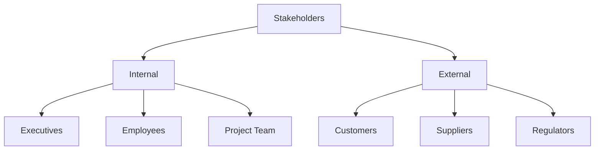
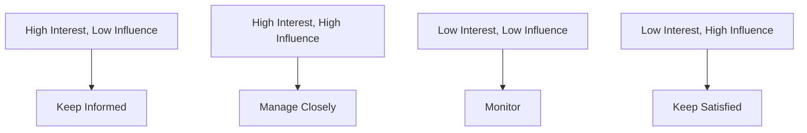

In this page, you'll learn:

- How to identify and analyze stakeholders
- Techniques for effective communication in business analysis
- Strategies for managing stakeholder expectations
- Tips for resolving conflicts and building consensus

## Stakeholders: The People Who Make or Break Your Project

Ever been to a family reunion where Uncle Bob and Aunt Sally are fighting over who makes the best potato salad? Well, managing stakeholders in a business analysis project can sometimes feel a lot like that – except instead of potato salad, you're dealing with million-dollar budgets and company-wide changes. Fun, right?

### What's a Stakeholder Anyway?

A stakeholder is anyone who has a stake (get it?) in your project. They could be affected by it, have influence over it, or both. Think of them as the cast of characters in your business analysis drama.

### Stakeholder Identification: Who's Who in Your Project Zoo

Identifying stakeholders is like being a detective, minus the cool hat and magnifying glass. Here's how to do it:

1. Brainstorm with your team
2. Review project documents
3. Check organizational charts
4. Ask around (yes, even the office gossip can be useful here)

**Remember:** Don't forget about the quiet ones! Sometimes the stakeholders who don't make a lot of noise can have the biggest impact.

### Stakeholder Analysis: Getting to Know Your Cast

Once you've identified your stakeholders, it's time to analyze them. This is where you figure out who's who and what makes them tick.

| Aspect              | Questions to Consider                                       |
| ------------------- | ----------------------------------------------------------- |
| Interest            | How invested are they in the project?                       |
| Influence           | How much power do they have over the project?               |
| Impact              | How much will the project affect them?                      |
| Communication Needs | How often and in what way should you communicate with them? |

**Tip:** Create a stakeholder matrix to visualize interest vs. influence. It'll help you prioritize your stakeholder management efforts.

## Communication: More Than Just Talking

If you thought communication was just about talking, boy, do we have news for you! In business analysis, communication is an art form. It's about getting the right information to the right people at the right time in the right way. Easy peasy, right?

### The Communication Plan: Your Roadmap to Stakeholder Happiness

A communication plan is like a GPS for your project communication. It helps you navigate the treacherous waters of stakeholder expectations and project updates.

Here's what your communication plan should include:

1. Who needs what information
2. When they need it
3. How they prefer to receive it
4. Who's responsible for delivering it

**Warning:** Don't assume everyone wants a 50-page report every week. Some stakeholders might prefer a quick chat or a one-page summary.

### Active Listening: It's Not Just Hearing, It's Understanding

Active listening is like being a human sponge – you're soaking up not just the words, but the meaning behind them. Here are some tips:

- Make eye contact (but don't stare like a creepy doll)
- Use non-verbal cues (nod, smile, but maybe skip the interpretive dance)
- Paraphrase to confirm understanding ("So what you're saying is...")
- Ask open-ended questions

**Try This:** In your next meeting, count how many times you interrupt someone. Then try to cut that number in half. Your stakeholders (and your karma) will thank you.

### Non-Verbal Communication: What You're Saying When You're Not Saying Anything

Did you know that up to 93% of communication is non-verbal? That means even when you're not talking, you're still communicating. Mind-blowing, right?

Pay attention to:

- Body language
- Facial expressions
- Tone of voice
- Personal space (especially in different cultures)

**Remember:** In virtual meetings, non-verbal cues can be harder to pick up. Be extra attentive and don't be afraid to ask for clarification.

## Stakeholder Management: Herding Cats, But Make It Professional

Managing stakeholders is a bit like herding cats – if the cats all had different opinions about the project and the power to approve your budget. Fun times!

### Managing Expectations: The Art of Under-Promising and Over-Delivering

Managing expectations is crucial. Here's how to do it:

1. Be clear about what the project will (and won't) deliver
2. Communicate early and often about progress and challenges
3. Be honest about risks and limitations

**Tip:** It's better to pleasantly surprise stakeholders than to disappoint them. Set realistic expectations and then exceed them.

### Conflict Resolution: When Stakeholders Attack (Not Literally, We Hope)

Conflict is inevitable in any project. The key is how you handle it. Here's a step-by-step guide:

1. Stay calm (deep breaths, count to ten, picture everyone in silly hats)
2. Identify the real issue (it's not always what people say it is)
3. Listen to all sides (remember that active listening we talked about?)
4. Focus on common ground
5. Brainstorm solutions together
6. Agree on a path forward

**Warning:** Don't take sides or play favorites. Your job is to be a neutral party and find a solution that works for the project.

### Building Consensus: Getting Everyone on the Same Page (Or at Least in the Same Book)

Building consensus is about finding a solution that everyone can live with, even if it's not their first choice. Here's how:

1. Clearly define the issue
2. Encourage open discussion
3. Find areas of agreement
4. Propose solutions that address everyone's main concerns
5. Use decision-making techniques (like multi-voting or nominal group technique)

**Remember:** Consensus doesn't mean everyone gets exactly what they want. It means finding a solution everyone can support.

## The Art of Influence: How to Get Things Done Without Formal Authority

As a business analyst, you often need to influence people without having direct authority over them. It's like being a Jedi, but with more spreadsheets and fewer lightsabers.

### Building Relationships: Your Secret Weapon

Building strong relationships is key to influencing others. Here's how:

1. Be genuine and authentic
2. Show interest in others
3. Be reliable and follow through on commitments
4. Offer help without expecting immediate returns

**Try This:** Set a goal to have a non-work-related conversation with one stakeholder each week. You'll be surprised how much it can improve your working relationship.

### The Power of Persuasion: It's Not Mind Control, We Promise

Persuasion is about presenting your ideas in a way that resonates with others. Here are some techniques:

1. Use data and facts to support your arguments
2. Tell stories to make your points memorable
3. Appeal to emotions as well as logic
4. Show how your ideas benefit the stakeholder or align with their goals

**Tip:** Tailor your persuasion techniques to your audience. What works on the CEO might not work on the IT team, and vice versa.

## Wrapping Up: You're Now a Communication and Stakeholder Management Ninja!

Congratulations! You've made it through the wild world of communication and stakeholder management. You're now equipped to identify stakeholders, communicate effectively, manage expectations, resolve conflicts, and influence without authority.

Remember, like any skill, these take practice to master. So go forth, communicate, manage those stakeholders, and may the business analysis force be with you!

**Key Takeaways:**

- Identify and analyze your stakeholders
- Develop a solid communication plan
- Practice active listening and pay attention to non-verbal cues
- Manage expectations and resolve conflicts
- Build consensus and influence without formal authority

Now, go out there and make Uncle Bob and Aunt Sally proud – or at least get them to agree on the potato salad recipe!
