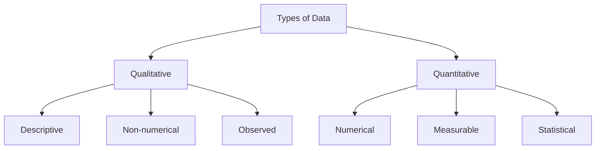
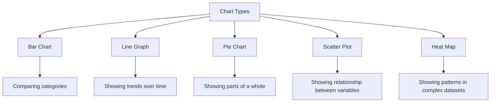

In this page, you'll learn:

- The importance of data in business analysis
- How to collect and prepare data for analysis
- Basic and advanced data analysis techniques
- How to interpret data and present your findings
- Common pitfalls in data analysis and how to avoid them

## Welcome to the Data Jungle: Where Numbers Tell Stories (If You Know How to Listen)

Greetings, intrepid business analyst! You've entered the wild and wonderful world of data analysis and interpretation. It's a place where numbers dance, charts sing, and if you're not careful, you might find yourself lost in a forest of spreadsheets. But fear not! By the end of this page, you'll be swinging through the data vines like a pro.

### Why Data Matters: Because Guessing is So Last Century

In the olden days (you know, like the 1990s), business decisions were often made based on hunches, gut feelings, and that weird dream the CEO had last night. But in today's data-driven world, we have a much more reliable tool: cold, hard facts.

Data analysis allows you to:

1. Make informed decisions
2. Identify trends and patterns
3. Predict future outcomes
4. Measure the success of your projects

**Remember:** Data is like a superpower. Use it responsibly, or you might end up convincing your company to invest all its money in pet rocks. Again.

## Data Collection: Gathering Your Ingredients for the Analysis Feast

Before you can analyze data, you need to have data. Shocking, I know. But not all data is created equal. You need to make sure you're collecting the right data in the right way.

### Types of Data: Qualitative vs. Quantitative

There are two main types of data:

1. **Qualitative Data:** Descriptive information that can be observed but not measured. Like your aunt's opinion on your new haircut.
2. **Quantitative Data:** Numerical information that can be measured and analyzed statistically. Like how many times your cat ignored you today.

**Tip:** Most analyses use both types of data. Quantitative data tells you the "what," while qualitative data helps you understand the "why."

### Data Collection Methods: Choose Your Weapon

There are many ways to collect data. Here are a few common methods:

1. **Surveys:** Great for collecting both qualitative and quantitative data from a large group.
2. **Interviews:** Perfect for deep, qualitative insights.
3. **Observation:** Ideal for understanding processes and behaviors.
4. **Existing Data:** Don't reinvent the wheel. Check what data your organization already has.

5. **Web Analytics:** For all your digital data needs.

**Warning:** Be careful of bias in your data collection. If you only survey people who love spinach, don't be surprised when your results suggest that everyone loves spinach.

## Data Preparation: Cleaning Up the Mess (Because Data is Messy)

Congratulations! You've collected your data. Now comes the fun part: making it usable. This process is called data cleaning or data preparation.

### Steps in Data Preparation:

1. **Remove Duplicates:** Because two identical data points aren't twice as nice.
2. **Handle Missing Values:** Decide whether to remove or impute missing data.
3. **Correct Formatting:** Make sure your dates are dates and your numbers are numbers.
4. **Deal with Outliers:** Decide if that data point is an error or just really, really special.

**Try This:** Take a small dataset and go through these steps. It's like cleaning your room, but with spreadsheets instead of old socks.

## Basic Data Analysis: Starting Your Data Detective Work

Now that your data is squeaky clean, it's time to start analyzing. We'll start with some basic techniques that even your data-phobic colleague can understand (you know, the one who still uses an abacus).

### Descriptive Statistics: Just Describing What You See

Descriptive statistics are like describing a picture to someone. You're just stating what's there, not interpreting it.

Key descriptive statistics include:

- Mean (average)
- Median (middle value)
- Mode (most common value)
- Range (difference between highest and lowest values)
- Standard Deviation (how spread out the data is)

| Statistic          | Example                                                     |
| ------------------ | ----------------------------------------------------------- |
| Mean               | The average sale price of all houses sold last month        |
| Median             | The middle value of all house prices when arranged in order |
| Mode               | The most common house price                                 |
| Range              | The difference between the highest and lowest house prices  |
| Standard Deviation | How much house prices typically differ from the mean        |

**Remember:** Descriptive statistics are like the trailer for a movie. They give you a general idea, but you need to dig deeper for the full story.

### Data Visualization: Because a Picture is Worth a Thousand Spreadsheets

Data visualization is the art of presenting data in a visual format. It's like giving your data a makeover.

Common types of data visualizations include:

1. Bar charts
2. Line graphs
3. Pie charts (use sparingly, or risk the wrath of data visualization purists)
4. Scatter plots
5. Heat maps

**Tip:** Choose your visualization based on what story you're trying to tell with your data. And please, for the love of all that is holy, don't use 3D effects unless you're making a Pixar movie.

## Advanced Data Analysis: Unleashing Your Inner Data Scientist

Ready to take your data analysis to the next level? Strap in, because we're about to get fancy.

### Correlation Analysis: When Two Variables Go on a Date

Correlation analysis helps you understand the relationship between two variables. Are they best friends, mortal enemies, or just casual acquaintances?

The correlation coefficient ranges from -1 to 1:

- 1: Perfect positive correlation (as one goes up, the other goes up)
- 0: No correlation (they're just not that into each other)
- -1: Perfect negative correlation (as one goes up, the other goes down)

**Warning:** Correlation does not imply causation. Just because ice cream sales and sunburn cases are correlated doesn't mean ice cream causes sunburn. (Though it might be a delicious way to soothe it.)

### Regression Analysis: Predicting the Future (Sort Of)

Regression analysis is like a crystal ball for your data. It helps you predict a dependent variable based on one or more independent variables.

For example, you might use regression to predict sales based on advertising spend, weather, and day of the week.

**Remember:** Regression models are only as good as the data you put into them. Garbage in, garbage out!

### Cluster Analysis: Finding the Cliques in Your Data

Cluster analysis is like organizing a big party. You're trying to group similar data points together based on their characteristics.

This can be useful for:

- Customer segmentation
- Pattern recognition
- Anomaly detection

**Try This:** Next time you're at a party, try doing a mental cluster analysis of the guests. Just don't tell them you're doing it. That might be weird.

## Data Interpretation: Making Sense of the Madness

Congratulations! You've analyzed your data six ways to Sunday. But what does it all mean? That's where interpretation comes in.

### Steps in Data Interpretation:

1. **Identify Patterns and Trends:** What story is your data telling?
2. **Compare to Expectations:** How does this align with what you thought you'd see?
3. **Consider Context:** What external factors might be influencing your results?
4. **Draw Conclusions:** Based on your analysis, what can you conclude?
5. **Generate Insights:** What actions can be taken based on these conclusions?

**Tip:** Always be prepared to explain your interpretation. "Because the data said so" is not a sufficient explanation (no matter how much you might want it to be).

## Presenting Your Findings: Don't Put Your Audience to Sleep

You've done all this amazing analysis. Now it's time to share it with the world (or at least your team and stakeholders).

### Tips for Effective Data Presentation:

1. **Know Your Audience:** Tailor your presentation to their level of data literacy.
2. **Tell a Story:** Don't just show numbers. Weave them into a compelling narrative.
3. **Keep it Simple:** Not everyone loves data as much as you do. Focus on the key points.
4. **Use Visuals:** But remember, just because you can make a 3D exploding pie chart doesn't mean you should.
5. **Be Prepared for Questions:** Anticipate what people might ask and have supporting data ready.

**Remember:** Your goal is to inform and persuade, not to showcase every single analysis you did. Save that for your data analyst fan club meetings.

## Common Pitfalls in Data Analysis: Don't Fall Into the Data Trap

Even the best data analysts can make mistakes. Here are some common pitfalls to avoid:

1. **Cherry-Picking Data:** Don't just use the data that supports your hypothesis. That's not analysis, that's confirmation bias in a fancy suit.

2. **Ignoring Outliers:** Sometimes the most interesting insights come from the data points that don't fit the pattern.

3. **Mistaking Correlation for Causation:** We mentioned this before, but it's worth repeating. Correlation does not imply causation!

4. **Overgeneralizing:** Just because something is true for your sample doesn't mean it's true for the entire population.

5. **Forgetting About Data Quality:** Bad data leads to bad analysis. Always question the quality and reliability of your data sources.

**Tip:** Develop a healthy skepticism towards your own analysis. Always ask yourself, "What might I be missing?"

## Wrapping Up: You're Now a Data Analysis Ninja!

Congratulations! You've made it through the data jungle. You're now equipped to collect, prepare, analyze, interpret, and present data like a pro.

Remember, data analysis is as much an art as it is a science. It takes practice to develop your skills and intuition. So go forth, analyze some data, and may your insights be ever profound and your stakeholders ever impressed!

**Key Takeaways:**

- Collect the right data in the right way
- Clean and prepare your data before analysis
- Use a mix of basic and advanced analysis techniques
- Interpret your data in context
- Present your findings in a clear, compelling way
- Be aware of common pitfalls in data analysis

Now, go forth and crunch those numbers! Just remember, if anyone asks you to predict next week's lottery numbers, it might be time to remind them about the limitations of data analysis.
