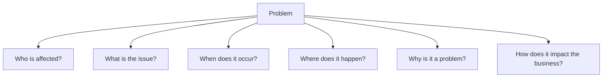
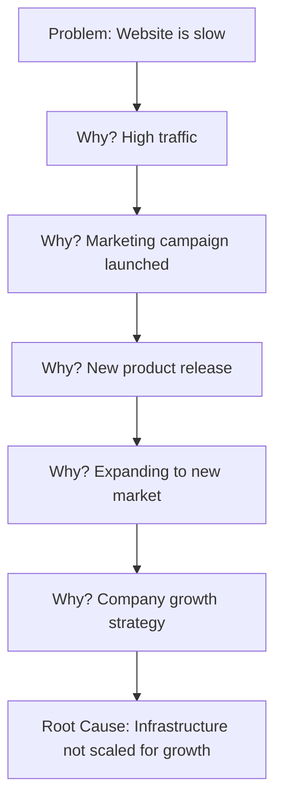
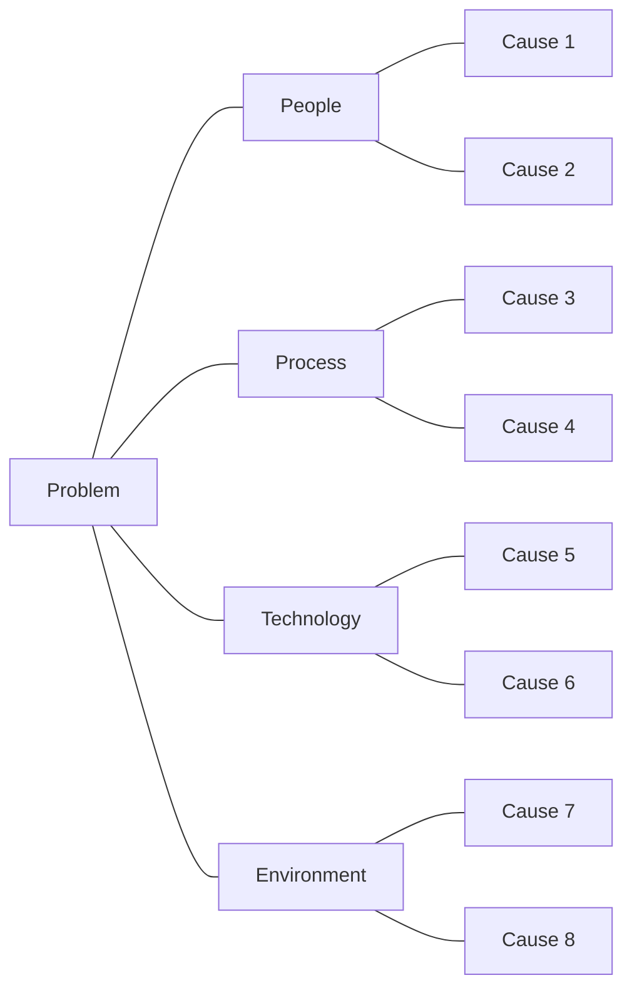
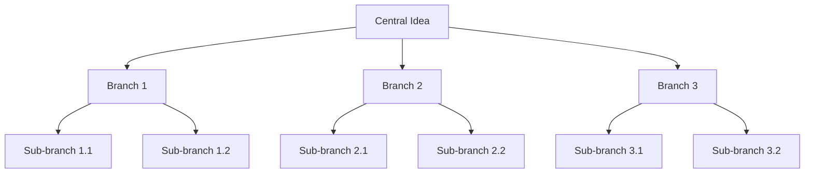
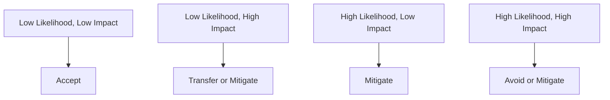

This format provides a concise summary of the page's content and purpose, making it easy for readers to quickly understand what they'll learn. The brain emoji (🧠) is used as an icon to represent the cognitive skills discussed in the page.
In this page, you'll learn:

- How to define and analyze problems effectively
- Techniques for creative and critical thinking
- Strategies for making better decisions
- Tips for overcoming common problem-solving pitfalls

## Houston, We Have a Problem (But We're Gonna Solve It!)

Welcome to the wild world of problem-solving and critical thinking! If business analysis were a superhero movie, these skills would be your superpowers. They're what separate the "meh" business analysts from the "wow, how did they do that?" business analysts. So, put on your thinking cap (yes, that's a real thing), and let's dive in!

### What's the Problem with Problems?

Before we start solving problems, let's talk about what a problem actually is. In the world of business analysis, a problem is any situation that's keeping the business from achieving its goals. It could be as simple as "our website is slower than a snail on a coffee break" or as complex as "our entire business model is becoming obsolete faster than you can say 'Blockbuster Video'."

**Remember:** Not all problems are created equal. Some are minor inconveniences, while others are "oh no, the building is on fire" level emergencies. Part of your job is figuring out which is which.

## Problem Definition: If You Can Name It, You Can Tame It

The first step in solving any problem is defining it clearly. It's like trying to hit a target – if you can't see it clearly, you're just going to be flailing around in the dark (and probably knocking over a lot of stuff in the process).

### The 5W1H Method: Your Problem-Defining Swiss Army Knife

One tried-and-true method for defining problems is the 5W1H method. It's like playing 20 Questions, but with a purpose.

**Try This:** Take a problem you're currently facing and run it through the 5W1H method. You might be surprised at how much clearer the problem becomes!

### Problem Statement: Your North Star

Once you've gathered all that juicy information, it's time to craft a problem statement. This is a clear, concise description of the issue that will guide your problem-solving efforts.

A good problem statement should:

1. Describe the current situation
2. Identify the desired situation
3. Highlight the gap between the two

**Example:** "Our customer service team is currently handling an average of 50 calls per day (current situation), but we need to handle 100 calls per day to meet demand (desired situation). We need to find a way to double our call handling capacity without sacrificing quality (the gap)."

**Tip:** Keep your problem statement focused on the what, not the how. The "how" comes later in the problem-solving process.

## Root Cause Analysis: Digging Deep (Without Getting Dirty)

Now that you've defined your problem, it's time to figure out why it's happening. This is where root cause analysis comes in. It's like being a detective, but instead of solving crimes, you're solving business problems (and hopefully with less danger and more snacks).

### The 5 Whys: Not Just for Toddlers Anymore

The 5 Whys is a simple but powerful technique for getting to the root of a problem. Here's how it works:

1. Start with your problem statement
2. Ask "Why?" (like a curious toddler)
3. Answer the question
4. Ask "Why?" again
5. Repeat until you reach the root cause (usually around 5 times, hence the name)

**Warning:** Don't stop at the first plausible cause. Keep digging until you're sure you've hit bedrock.

### Fishbone Diagram: Not as Tasty as It Sounds

For more complex problems, you might need a fishbone diagram (also known as an Ishikawa diagram). It's a visual way to brainstorm and categorize potential causes of a problem.

**Try This:** Next time you're faced with a complex problem, gather your team and create a fishbone diagram. It's a great way to get everyone's ideas out in the open and identify areas for further investigation.

## Creative Thinking: Thinking Outside the Box (Without Getting Stuck in a Triangle)

Sometimes, solving problems requires a little creativity. It's time to channel your inner da Vinci (minus the beard and Renaissance attire, unless that's your thing).

### Brainstorming: Quantity Over Quality (At First)

Brainstorming is all about generating as many ideas as possible, no matter how crazy they might seem. Here are some tips:

1. Set a time limit (15-30 minutes usually works well)
2. Encourage wild ideas (the crazier, the better)
3. Build on others' ideas
4. Defer judgment (no idea-bashing allowed!)
5. Go for quantity

**Remember:** In brainstorming, there's no such thing as a bad idea. Except maybe "let's solve our cash flow problems by robbing a bank." That's probably a bad idea.

### Mind Mapping: Like a Family Tree for Your Ideas

Mind mapping is a visual brainstorming technique that can help you explore different aspects of a problem and generate new ideas.

**Tip:** Use colors, images, and symbols in your mind maps to make them more engaging and memorable.

## Critical Thinking: Separating the Wheat from the Chaff

Now that you've got a boatload of ideas, it's time to put on your critical thinking hat and figure out which ones are actually worth pursuing.

### Assumption Analysis: Questioning Everything (Except Gravity, That's Pretty Solid)

Many problems persist because of unchallenged assumptions. Your job is to challenge them. Here's how:

1. List all assumptions related to the problem
2. Question each assumption: Is it always true? Under what conditions might it be false?
3. Consider how the problem might change if the assumption weren't true

**Try This:** Take one of your current projects and list out all the assumptions you're making. You might be surprised at how many you find!

### Pros and Cons Analysis: The Classic for a Reason

Sometimes, the old ways are the best ways. A simple pros and cons list can help you evaluate potential solutions objectively.

| Solution          | Pros                                       | Cons                                              |
| ----------------- | ------------------------------------------ | ------------------------------------------------- |
| Hire more staff   | Increased capacity - Faster response times | Higher costs - Training time                      |
| Implement chatbot | 24/7 availability - Handles simple queries | Initial setup cost - May frustrate some customers |
| Outsource support | Scalable - Potentially lower costs         | Less control - Potential quality issues           |

**Remember:** Not all pros and cons are created equal. Consider weighting them based on their importance to your specific situation.

## Decision Making: Choosing Your Own Adventure (But With Spreadsheets)

You've defined the problem, analyzed it, and come up with potential solutions. Now comes the fun part: making a decision!

### Decision Matrix: When Gut Feeling Isn't Enough

A decision matrix helps you evaluate options based on multiple criteria. It's like a more sophisticated version of pros and cons.

| Criteria (Weight)            | Option A | Option B | Option C |
| ---------------------------- | -------- | -------- | -------- |
| Cost (0.3)                   | 3 (0.9)  | 2 (0.6)  | 1 (0.3)  |
| Ease of Implementation (0.2) | 2 (0.4)  | 3 (0.6)  | 1 (0.2)  |
| User Satisfaction (0.5)      | 2 (1.0)  | 3 (1.5)  | 3 (1.5)  |
| Total Score                  | 2.3      | 2.7      | 2.0      |

**Tip:** Be careful not to over-complicate your decision matrix. If you find yourself with 20 criteria and 15 options, it might be time to step back and simplify.

### Risk Analysis: Because What Could Go Wrong? (A Lot, Actually)

Before you commit to a decision, it's important to consider the potential risks. Here's a simple framework:

1. Identify potential risks
2. Assess their likelihood and impact
3. Develop mitigation strategies for high-priority risks

**Remember:** No solution is risk-free. The goal is to make an informed decision, not a perfect one.

## Overcoming Problem-Solving Pitfalls: Dodge, Duck, Dip, Dive, and... Think

Even the best problem-solvers can fall into traps. Here are some common pitfalls and how to avoid them:

1. **Analysis Paralysis:** Don't get so caught up in analyzing that you never actually solve the problem. Set deadlines for yourself.

2. **Confirmation Bias:** Actively seek out information that contradicts your beliefs. It's uncomfortable, but it leads to better decisions.

3. **Groupthink:** Encourage dissenting opinions in your team. Assign someone to play devil's advocate if necessary.

4. **Sunk Cost Fallacy:** Just because you've invested time or money in a solution doesn't mean it's the right one. Be willing to change course if needed.

5. **Jumping to Solutions:** Resist the urge to solve the problem immediately. Take the time to understand it thoroughly first.

**Tip:** Regularly reflect on your problem-solving process. What worked well? What could be improved? Continuous improvement isn't just for the problems you're solving – it's for your problem-solving skills too!

## Wrapping Up: You're Now a Problem-Solving, Critical-Thinking Machine!

Congratulations! You've made it through the mental gymnastics of problem-solving and critical thinking. You're now equipped to define problems, dig into root causes, think creatively, make decisions, and avoid common pitfalls.

Remember, like any skill, these take practice to master. So go forth, solve problems, think critically, and may your solutions be ever elegant and your stakeholders ever satisfied!

**Key Takeaways:**

- Define your problem clearly before trying to solve it
- Dig deep to find root causes
- Use creative thinking techniques to generate potential solutions
- Apply critical thinking to evaluate your options
- Make decisions based on careful analysis, not just gut feeling
- Be aware of common problem-solving pitfalls and how to avoid them

Now, go out there and solve some problems! Just remember, if anyone asks you to solve world peace by Friday, it's okay to ask for an extension.
