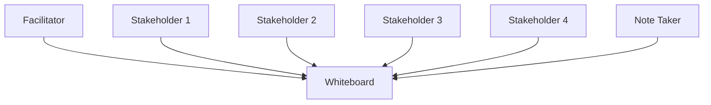
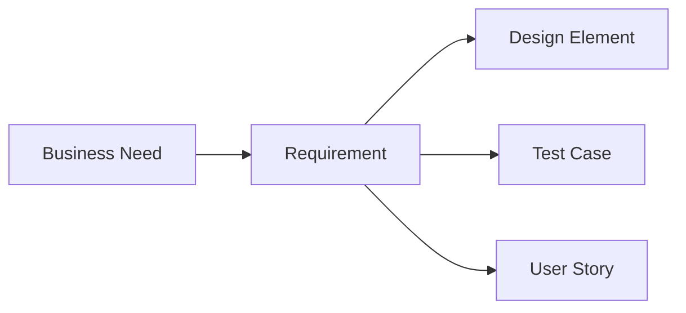

In this page, you'll learn:

- What requirements elicitation is and why it's crucial
- Various techniques for eliciting requirements
- How to manage and prioritize requirements
- Common challenges in requirements elicitation and how to overcome them
- Best practices for requirements documentation and traceability

## Welcome to the Requirement Rodeo: Where Business Needs Meet Lasso Skills!

Howdy, pardner! You've moseyed into the wild west of business analysis – requirements elicitation and management. It's a place where the tumbleweeds of business needs roll by, and you're the sheriff tasked with rounding them up. Don't worry if you feel like you're wearing spurs for the first time; by the end of this page, you'll be yelling "Yeehaw!" as you wrangle those requirements like a pro.

### What in Tarnation is Requirements Elicitation?

Requirements elicitation is the process of gathering information about what a solution needs to do to solve a business problem or achieve a business goal. It's like being a detective, but instead of solving crimes, you're solving business puzzles. And just like a detective, you'll need to use a variety of techniques to get to the bottom of things.

**Remember:** Requirements elicitation is not just about asking "What do you want?" It's about uncovering the real needs, even when stakeholders aren't sure what those are themselves.

## Elicitation Techniques: Your Business Analysis Toolkit

Just as a cowboy wouldn't head out to the range with just a lasso, you shouldn't rely on only one elicitation technique. Here's your toolkit of techniques to help you corral those requirements:

### 1. Interviews: The One-on-One Roundup

Interviews are like having a conversation at the saloon – it's just you and the stakeholder, talking about their needs and wants.

**Tips for successful interviews:**

- Prepare your questions in advance
- Listen more than you talk
- Ask open-ended questions
- Don't be afraid to ask "Why?"

**Try This:** Practice active listening in your next conversation. Try to repeat back what the other person said to ensure you understood correctly.

### 2. Workshops: The Town Hall Meeting

Workshops bring together a group of stakeholders to collaborate on requirements. It's like a barn-raising, but instead of a barn, you're building a shared understanding of the project needs.

**Tips for successful workshops:**

- Have a clear agenda
- Use visual aids (whiteboards, sticky notes, etc.)
- Encourage participation from all attendees
- Keep the discussion focused

**Warning:** Watch out for "loudest voice wins" syndrome. Make sure quieter stakeholders have a chance to contribute too.

### 3. Observation: Be the Fly on the Wall

Sometimes, the best way to understand what people need is to watch them work. It's like being a spy, but without the cool gadgets (sorry, no exploding pens here).

**Tips for effective observation:**

- Try not to interfere with normal work processes
- Take detailed notes
- Ask questions after the observation period
- Look for pain points and inefficiencies

**Remember:** People often do things differently when they know they're being watched. Try to be as unobtrusive as possible.

### 4. Questionnaires and Surveys: The Mass Roundup

When you need to gather information from a large group of stakeholders, questionnaires and surveys can be your best friend. It's like sending out wanted posters, but instead of outlaws, you're looking for requirements.

**Tips for creating effective questionnaires:**

- Keep questions clear and concise
- Use a mix of question types (multiple choice, open-ended, etc.)
- Test your questionnaire before sending it out
- Provide clear instructions for completion

**Try This:** Create a quick survey about your team's preferred meeting times. You'll practice creating questions and analyzing results.

### 5. Document Analysis: Digging Through the Archives

Sometimes, the requirements you need are already written down somewhere. Document analysis is like being an archeologist, digging through existing documentation to find requirement treasures.

**Tips for document analysis:**

- Start with the most recent documents
- Look for patterns and inconsistencies
- Don't assume all documented processes are still current
- Use findings as a starting point for discussions with stakeholders

**Warning:** Just because something is written down doesn't mean it's correct or up-to-date. Always verify your findings with stakeholders.

## Requirements Management: Herding Cats... Er, Requirements

Now that you've elicited all these requirements, you need to manage them. It's like being a rancher, but instead of cattle, you're herding a bunch of independent-minded cats... I mean, requirements.

### Prioritization: Which Requirement Gets the Prime Grazing Spot?

Not all requirements are created equal. You need to prioritize them to ensure the most important ones get addressed first.

| Technique       | Description                                    | Best Used When                                                |
| --------------- | ---------------------------------------------- | ------------------------------------------------------------- |
| MoSCoW          | Must have, Should have, Could have, Won't have | You need a quick, simple prioritization                       |
| Kano Model      | Basic, Performance, Excitement                 | You want to focus on user satisfaction                        |
| Value vs Effort | Plot requirements on a 2x2 matrix              | You need to balance business value with implementation effort |

**Tip:** Involve key stakeholders in the prioritization process. It helps build consensus and ensures everyone understands the rationale behind the priorities.

### Traceability: Following the Requirement Trail

Traceability is about linking requirements to their sources and to other project artifacts. It's like putting a GPS tracker on each requirement so you always know where it came from and where it's going.

**Benefits of traceability:**

- Ensures all requirements are addressed
- Helps assess the impact of changes
- Supports testing and validation
- Aids in project scoping and estimation

**Remember:** Traceability isn't just a nice-to-have. In many industries, it's a regulatory requirement. Better saddle up and get tracing!

## Common Challenges in Requirements Elicitation: Dodging Tumbleweeds

Even the most skilled cowboy encounters challenges on the range. Here are some common tumbleweeds you might need to dodge:

1. **Stakeholder Availability:** Sometimes, getting time with key stakeholders is harder than finding water in the desert.

   **Solution:** Be flexible with scheduling and consider alternative methods like video calls or asynchronous communication.

2. **Requirement Conflicts:** Different stakeholders might have conflicting requirements. It's like two cowboys fighting over the same watering hole.

   **Solution:** Facilitate discussions to find compromises and always tie requirements back to business goals.

3. **Scope Creep:** Requirements can multiply faster than rabbits if you're not careful.

   **Solution:** Maintain a clear project scope and use a change control process for new requirements.

4. **Analysis Paralysis:** Sometimes, you can get so caught up in gathering requirements that you never actually start building anything.

   **Solution:** Use iterative approaches and time-boxing to ensure you're making progress.

5. **Unstated Assumptions:** Stakeholders might assume certain things are obvious and not mention them.

   **Solution:** Always ask "why" and try to surface assumptions through probing questions.

**Tip:** Keep a journal of challenges you encounter and how you overcome them. It'll be a valuable resource as you grow in your career.

## Best Practices for Requirements Documentation: Writing the Epic Saga of Your Project

Documenting requirements is like writing the epic saga of your project. You want it to be clear, compelling, and free of plot holes.

1. **Use Clear, Unambiguous Language:** Avoid words like "maybe," "might," or "if possible."

2. **Be Specific and Measurable:** Instead of "The system should be fast," say "The system should load pages in less than 2 seconds."

3. **Use Consistent Terminology:** Create a glossary of terms to ensure everyone's speaking the same language.

4. **Include Visuals:** Diagrams, wireframes, and flowcharts can often explain things better than words alone.

5. **Keep it Organized:** Use a consistent structure and numbering system for your requirements.

6. **Make it Accessible:** Store requirements in a central location where all stakeholders can access them.

7. **Version Control:** Keep track of changes to requirements over time.

**Remember:** The goal of documentation is communication. If your stakeholders can't understand your requirements, you might as well be writing in ancient Sanskrit.

## Wrapping Up: You're Now a Requirements Wrangler Extraordinaire!

Congratulations, partner! You've made it through the wild west of requirements elicitation and management. You're now equipped to lasso those requirements, wrangle them into submission, and herd them towards project success.

Remember, like any skill, requirements elicitation takes practice. So saddle up, get out there, and start gathering those requirements. And if you ever feel lost, just remember: WWJWD (What Would John Wayne Do)?

**Key Takeaways:**

- Use a variety of elicitation techniques to gather requirements
- Prioritize requirements based on business value and effort
- Maintain traceability to link requirements to other project elements
- Be prepared for common challenges and have strategies to overcome them
- Document requirements clearly and consistently

Now, go forth and elicit those requirements! And remember, in the wild west of business analysis, the pen is mightier than the six-shooter. Happy trails!
